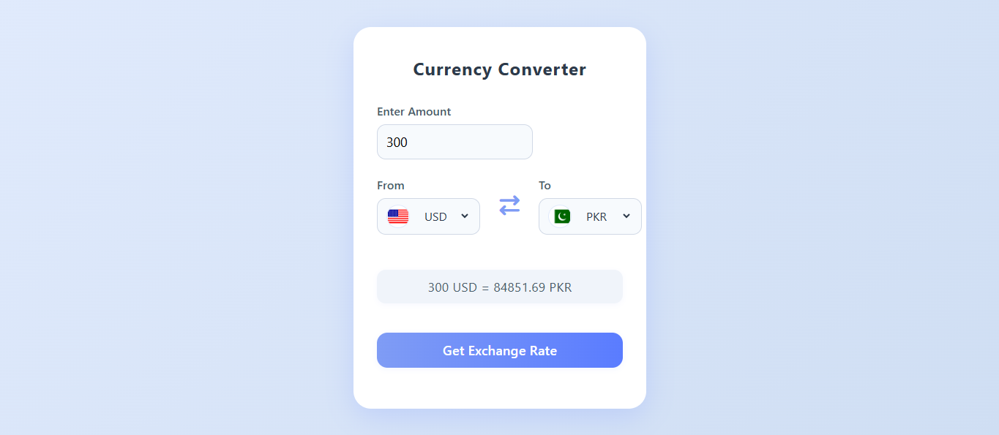

# 💱 Currency Converter (Fetch API)

This is a simple and responsive **Currency Converter** web app that allows users to convert amounts between different currencies in real-time using the **Fetch API**.

## 🚀 Features

- Real-time exchange rates using a free API
- Converts between multiple global currencies
- Clean and responsive UI
- Built with HTML, CSS, and JavaScript

## 🧪 Tech Stack

- HTML5
- CSS3
- JavaScript (ES6+)
- Fetch API

## 📸 Preview

## 📌 Note

This project is part of the **Front-End Projects** section in my learning path while mastering **MERN Stack Development**.

## 📬 Contact

Connect with me on [LinkedIn](https://www.linkedin.com/in/jawad-arshad-81773830a/)
