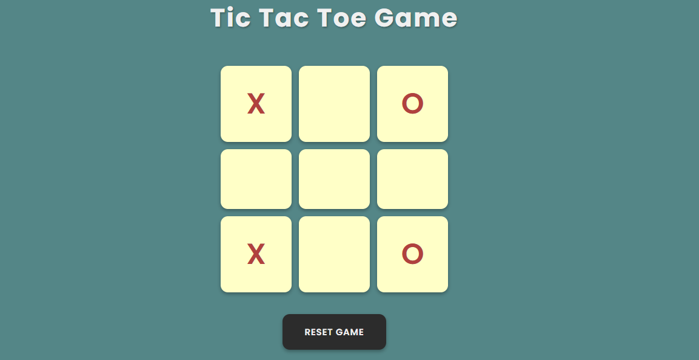

# 🎮 Tic-Tac-Toe Game

This is a simple **Tic-Tac-Toe** (also called Noughts and Crosses) game built using **HTML**, **CSS**, and **JavaScript**.

---

## 📌 Features

- Two-player game
- Win detection logic
- Draw condition
- Game reset functionality
- Visual indication of winner
- Clean UI with responsive design

---

## 🛠️ Tech Stack

- **HTML** – Structure
- **CSS** – Styling and layout
- **JavaScript** – Game logic (DOM, conditions)

---

## 📸 Preview

---

## 📌 Note

This project is part of the **Front-End Projects** section in my learning path while mastering **MERN Stack Development**.

---

## 📬 Contact

Connect with me on [LinkedIn](https://www.linkedin.com/in/jawad-arshad-81773830a/)
