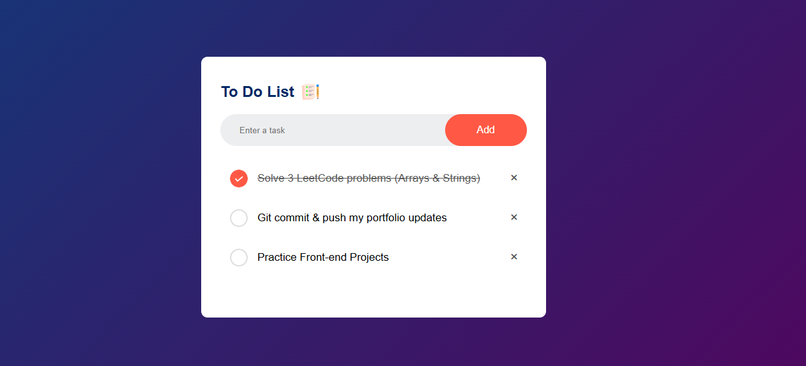

# 📝 To-Do App

A simple and interactive To-Do App built using HTML, CSS, and JavaScript.

## 🚀 Features
- Add tasks
- Mark tasks as completed
- Delete tasks
- Stored in browser's local storage

## 🧪 Tech Stack

- HTML5
- CSS3
- JavaScript (ES6+)
- Fetch API

## 📸 Screenshot
 <!-- Replace with actual image name -->

## 📌 Note

This project is part of the **Front-End Projects** section in my learning path while mastering **MERN Stack Development**.

## 📬 Contact

Connect with me on [LinkedIn](https://www.linkedin.com/in/jawad-arshad-81773830a/)
