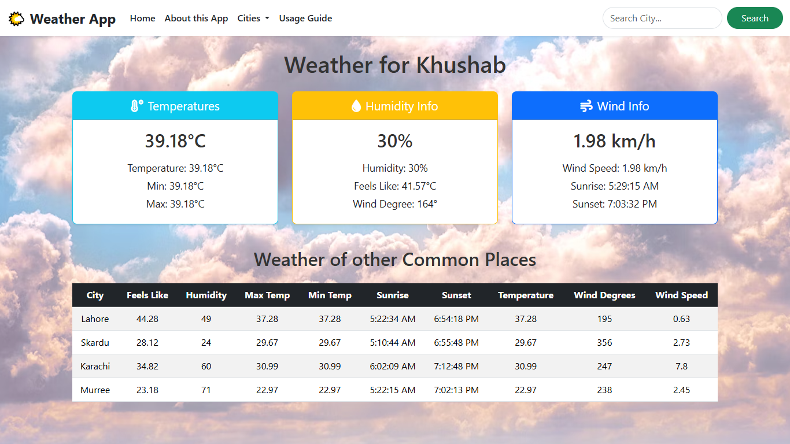

# Weather App 🌦️

This is a simple Weather App built with **HTML**, **CSS**, and **JavaScript** that fetches real-time weather data using the **OpenWeatherMap API**.

## 🚀 Features

- Real-time weather using [OpenWeatherMap API](https://openweathermap.org/api)
- Search by city name
- Displays temperature, condition, icon, humidity & wind speed
- Responsive and mobile-friendly layout
- Clean UI with basic error handling


## 📸 Preview




## 🧠 Tech Stack

- HTML
- CSS
- JavaScript (Fetch API)
- OpenWeatherMap API

## 📁 Folder Structure

Weather-App/
│
├── index.html
├── style.css
├── script.js
├── image.png
└── README.md


## 📌 How to Use

1. Clone the repo:
   ```bash
   git clone https://github.com/jawadarshad007/web-dev-practice.git

2.  Navigate:
   ```bash
    cd Front-End-Projects/Weather-App

3.  Open index.html in your browser.


## 📌 Note

This project is part of the **Front-End Projects** section in my learning path while mastering **MERN Stack Development**.

---

## 📬 Contact

Connect with me on [LinkedIn](https://www.linkedin.com/in/jawad-arshad-81773830a/)